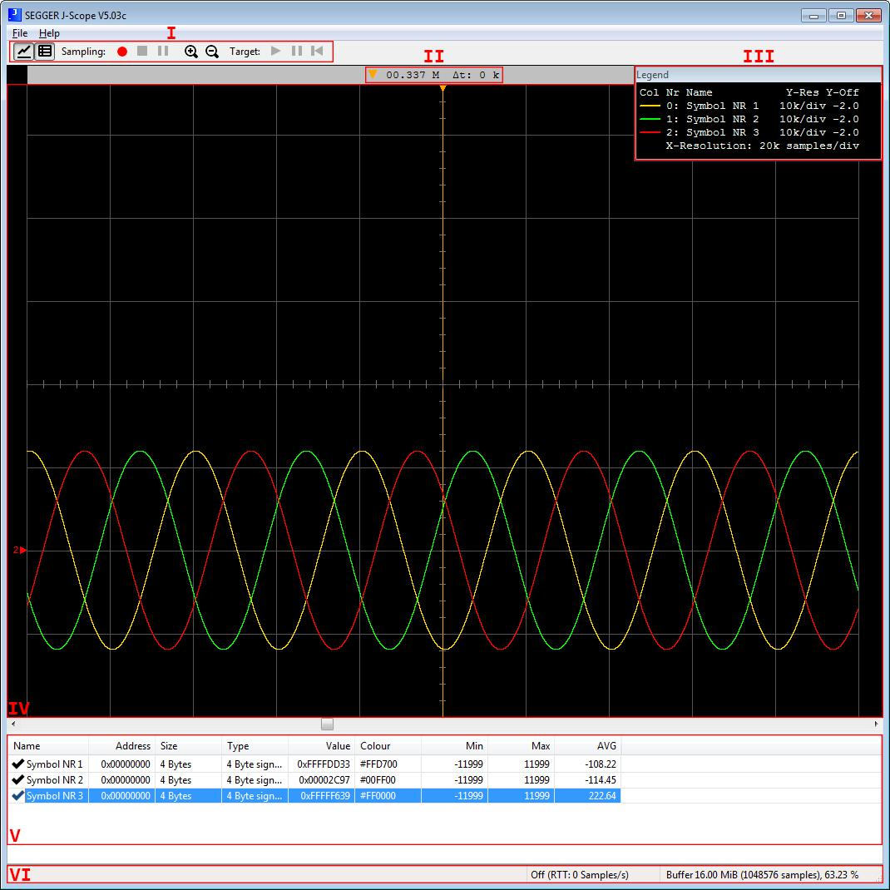

# 其他
> 简介
[参考资料](https://www.segger.com/downloads/jlink)

## SystemView - 实时分析和可视化

说明文件[UM08027_SystemView.pdf](file:///S:/参考文档/嵌入式/调试/UM08027_SystemView.pdf)

## 示波器

说明文件[UM08028_JScope.pdf](file:///S:/参考文档/嵌入式/调试/UM08028_JScope.pdf)